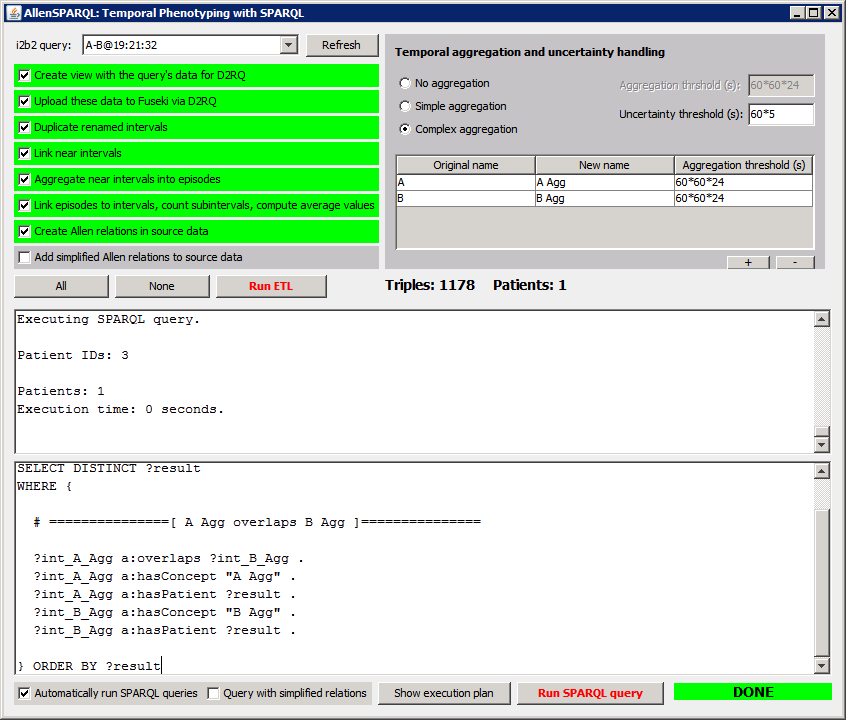

# AllenSPARQL

AllenSPARQL is an RDF- and SPARQL based temporal phenotyping engine. It can be used to translate and execute temporal phenotyping queries which have been created with the AllenGUI tool, into SPARQL queries. The tool uses i2b2, D2RQ, Fuseki 2, Python, "sagecell-client.py" (see: https://github.com/sagemath/sagecell/blob/master/contrib/sagecell-client/) and SageMathCell (see: https://sagecell.sagemath.org/).

For information on how to build the source code, please follow INSTALLATION.txt.

This package also contains a small test data set. A description on how to use this is contained in the "Test Dataset" subdirectory.

